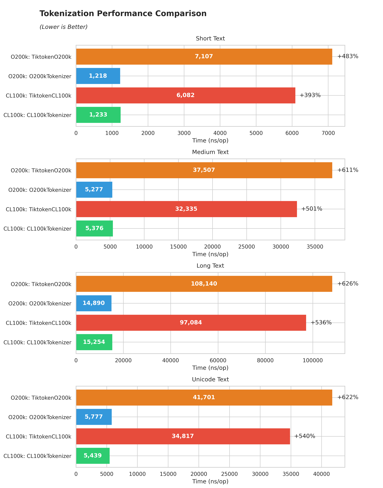

# bpe-openai-go

Go bindings for OpenAI's BPE tokenizer implemented in Rust. This project provides high-performance tokenization capabilities for Go applications, offering significant speed improvements over pure Go implementations.

This project wraps GitHub's [Rust BPE implementation](https://github.com/github/rust-gems/tree/main/crates/bpe), which is part of their `rust-gems` collection. The implementation is known for its speed, correctness, and novel algorithms for Byte Pair Encoding.

## Performance

Our Rust-based implementation shows significant performance improvements compared to the pure Go implementation ([tiktoken-go](https://github.com/pkoukk/tiktoken-go)):



Key findings:
- 4-6x faster than tiktoken-go across all text types
- CL100k model shows ~393-540% improvement
- O200k model shows even better results with ~483-626% improvement
- Consistent performance gains for both short and long texts
- Particularly efficient with Unicode text, showing a 622% improvement for O200k

## Installation

The package includes pre-compiled libraries for:
- Linux (x86_64, arm64)
- macOS (x86_64, arm64)
- Windows (x86_64)

### Using `go get`

```bash
go get github.com/edit4i/gh-bpe-openai-go
```

> For now, the github action is not working properly, so you'll need to build from source. But will update this ASAP

The appropriate library for your platform is included in the package and will be automatically used during compilation.

### Building from Source

If you need to build for a different platform or want to optimize for your specific architecture:

1. Install Rust toolchain (https://rustup.rs/)
2. Clone the repository with submodules:
```bash
git clone --recursive https://github.com/edit4i/gh-bpe-openai-go
cd gh-bpe-openai-go
```
3. Build the Rust library:
```bash
cd rust
cargo build --release
```
4. Copy the built library to the appropriate location:
```bash
# Linux
cp target/release/libbpe_openai_ffi.so ../lib/linux_amd64/

# macOS
cp target/release/libbpe_openai_ffi.dylib ../lib/darwin_amd64/

# Windows
cp target/release/bpe_openai_ffi.dll ../lib/windows_amd64/
```

## Usage

Here's a simple example of how to use the tokenizer:

```go
package main

import (
    "fmt"
    "log"
    
    bpe "github.com/edit4i/gh-bpe-openai-go"
)

func main() {
    tokenizer, err := bpe.NewCL100kTokenizer()
    if err != nil {
        log.Fatal(err)
    }
    defer tokenizer.Free()

    text := "Hello, world!"
    tokens, err := tokenizer.Encode(text)
    if err != nil {
        log.Fatal(err)
    }

    fmt.Printf("Tokens: %v\n", tokens)
}
```

Check out the [examples](examples/) directory for more usage examples.

## Available Models

- `CL100k` - Used by GPT-4, GPT-3.5-turbo, text-embedding-3-*
- `O200k` - Used by earlier models like GPT-3

## Project Structure

The project is organized as follows:
- `bpe-openai-ffi/` - Rust FFI layer that provides C bindings
- `rust-gems/` - Submodule containing GitHub's Rust BPE implementation
- `benchmark/` - Performance benchmarks and visualization
- `examples/` - Usage examples
- Root files:
  - `bpe.go` - Main Go bindings
  - `bpe_test.go` - Test suite
  - `cbindgen.toml` - C bindings configuration

## Development

### Prerequisites

- Go 1.21+
- Rust (latest stable)
- cbindgen (for generating C headers)

### Building

```bash
# Clone with submodules
git clone --recursive git@github.com:edit4i/gh-bpe-openai-go.git
cd gh-bpe-openai-go

# If you already cloned without --recursive:
git submodule update --init --recursive

# Build
make build
```

### Running Tests

```bash
make test
```

### Running Benchmarks

```bash
# Run the benchmarks
go test -bench=.

# Generate benchmark visualization (requires Python)
make performance # will generate "benchmark.txt"
mv benchmark.txt benchmark/benchmark.txt

cd benchmark
pip install -r requirements.txt
python plot_benchmark.py
```

## License

MIT License - see [LICENSE](LICENSE) for details.

## Contributing

Contributions are welcome! Please feel free to submit a Pull Request.

### Maintaining Pre-compiled Binaries

When updating the Rust implementation, please rebuild and update the pre-compiled binaries for all supported platforms:

1. Build for each platform using appropriate cross-compilation tools
2. Place the compiled libraries in the correct `lib/` subdirectories:
   - Linux: `lib/linux_amd64/libbpe_openai_ffi.so`, `lib/linux_arm64/libbpe_openai_ffi.so`
   - macOS: `lib/darwin_amd64/libbpe_openai_ffi.dylib`, `lib/darwin_arm64/libbpe_openai_ffi.dylib`
   - Windows: `lib/windows_amd64/bpe_openai_ffi.dll`
3. Test the package on each platform to ensure the binaries work correctly
4. Update the version number in both Rust and Go code

### Cross-compilation Tips

For cross-compilation, you can use:
- Docker for Linux targets
- OSX Cross for macOS targets
- MinGW-w64 for Windows targets

Example cross-compilation commands will be provided in the `scripts/` directory.

## Acknowledgments

This project wouldn't be possible without:
- [GitHub's Rust Gems](https://github.com/github/rust-gems) - The underlying Rust implementation
- [tiktoken-go](https://github.com/pkoukk/tiktoken-go) - For benchmark comparisons and inspiration
